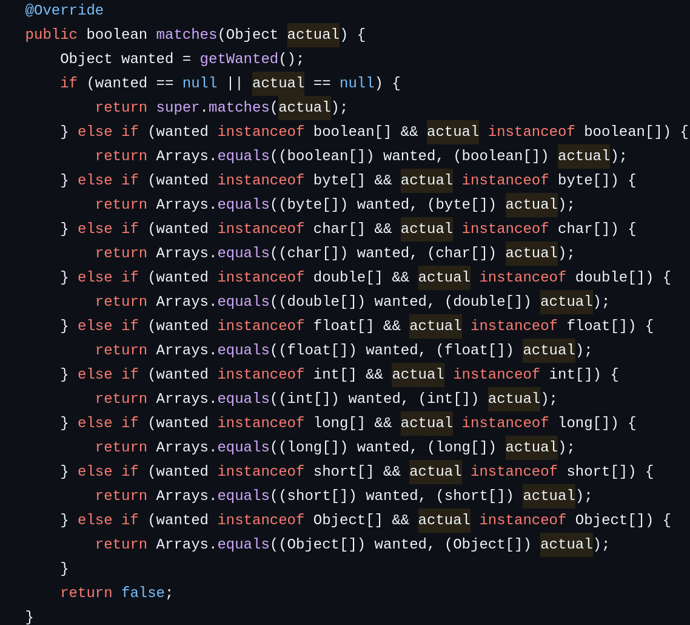
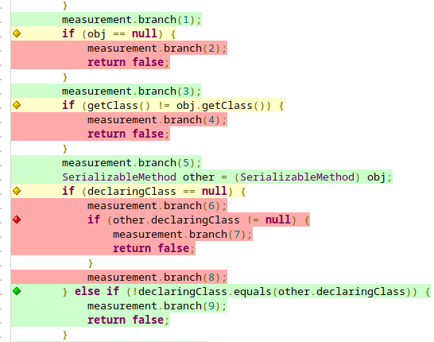
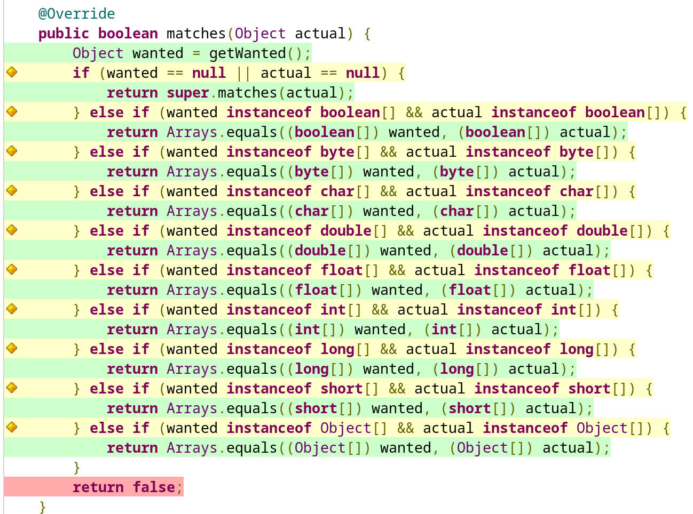
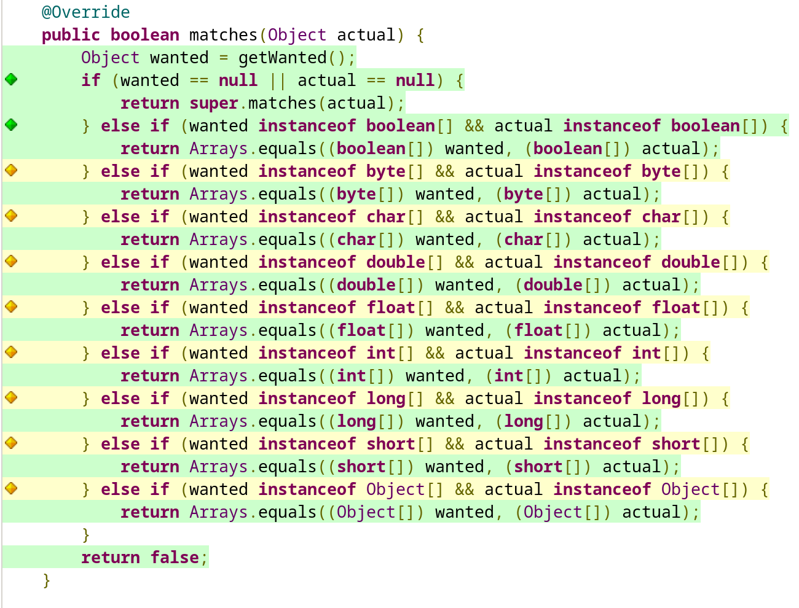
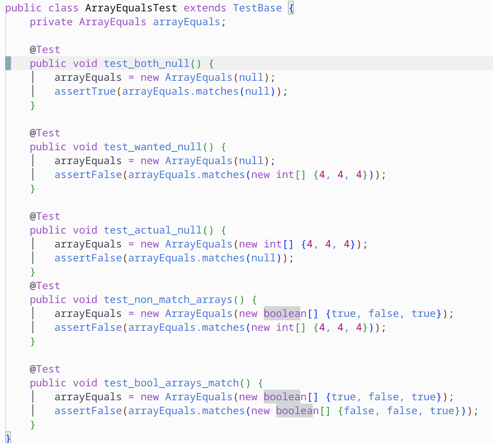
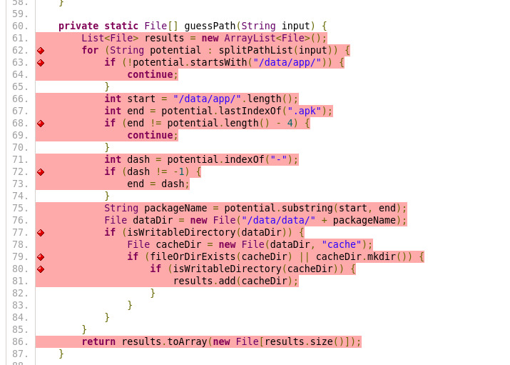
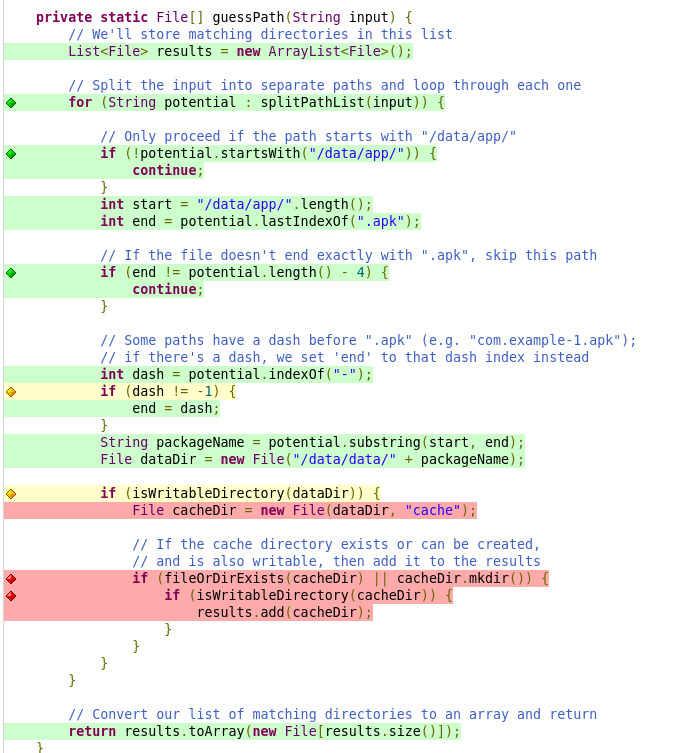

# Report for assignment 3

## Grading

Adam, Alix and Leo are aiming for P+, see their "Assignment #3, extra coverage" submissions for the details.
Samer and Anass are aiming for P.

## Project

Name: Mockito

URL: [github](https://github.com/mockito/mockito)

One or two sentences describing it
Mockito is a testing framework for java that allows one to unit test aspects of code that are normally not possible to unit test.

## Onboarding experience

Did it build and run as documented?

Initially, we had a lot of trouble as the project does not seem to work with Java 23 but only with Java 21, which was not documented. We had issues with our computers not being willing to switch properly to using Java 21 unless rebooted even with the right package installed. After that though it builds easily. As Jacoco was already integrated with the project it was easy to get a suitable report by running './gradlew test' and then './gradlew coverageReport'


## Complexity

1. What are your results for five complex functions?
   * Did all methods (tools vs. manual count) get the same result?
   * Are the results clear?

- 'InlineDelegateByteBuddyMockMaker::InlineDelegateByteBuddyMockMaker()'
Lizard reports a CCN of 24, manual count by Alix gives 23, Leo gives 23, the difference comas from the try/catch/finally blocks that can be tricky to take into account and are present multiple times in the constructor

- 'ArrayEquals::matches'
Lizard reports a CCN of 21, manual count by Alix gives 21, Leo gives 21 

- 'EqualsBuilder::append(Object, Object)'
Lizard reports a CCN of 17, manual count by Alix gives 17, Leo gives 17

- 'SerializableMethod::equals'
Lizard reports a CCN of 14, manual count by Alix gives 14, Leo gives 14

- ValuePrinter::print
Lizard reports a CCN of 14, manual count by Alix gives 12, Leo gives 12
2. Are the functions just complex, or also long?
- 'InlineDelegateByteBuddyMockMaker::InlineDelegateByteBuddyMockMaker()'
This function is very long about 123 LOC. This will naturally lead to a higher complexity function. 
- 'ArrayEquals::matches'
This function is only 24 LOC the complexity comes from the high amount of else-if statements.  
- 'EqualsBuilder::append(Object, Object)'
This method is 46 LOC but has a high amount of if statements. 
- 'SerializableMethod::equals'
Even though this is not as long as the InlineDelegateByteBuddyMockMaker constructor (40 LOC), the complexity roots from the high amount of if statements in the method.
- 'ValuePrinter::print'
Only 56 LOC, but the complexity roots in the high amount of if statements. 

3. What is the purpose of the functions?
- 'InlineDelegateByteBuddyMockMaker::InlineDelegateByteBuddyMockMaker()'
Creates an instance of the InlineByteBuddyMockMacker. The InlineByteBuddyMockMacker enables the mocking of final types and methods.  
- 'ArrayEquals::matches'
 Compares the given array object to the wanted field of the class. The method compares the type from different types from the Array class. If the type matches it uses the equals method from the Array class with the matched type. It does this for each primitive type and has a catch-all for object types for the final if-statement. In case all evaluate to false, there is a return false at the end of scope.  
- 'EqualsBuilder::append(Object, Object)'
The class enables the creation of the equals method for any class. The specific append method compares two objects, checking if they are equal by using their own equals methods. The high amount of if statements comes from comparing multidimensional arrays with the same depth. The if statement chooses the correct handler for the inner type.   
- 'SerializableMethod::equals'
Compares objects using multiple operators.
- 'ValuePrinter::print'
Implemented to handle "explosive" toString() implementations.  
4. Are exceptions taken into account in the given measurements?
Yes, in Lizard every `catch` block increases the cyclomatic complexity by 1. However, `finally` blocks are not counted. 
5. Is the documentation clear w.r.t. all the possible outcomes?
It differs between implementations, but overall it is not - documented in a clear way. 

## Refactoring

Plan for refactoring complex code:
- **Method `AndroidTempFileLocator.guessPath` (Anass)** There is unfortunately no good way to refactor this code.
The `guessPath()` method relies on parsing file paths in a way that is tightly coupled to the specific structure of Android's /data/app/ directory. The logic for extracting the package name, handling dashes in APK filenames, and checking the writability of directories is all necessary to ensure correct behavior.

- **Method `ArrayEquals.matches` (Leo)**
There is no reasonble way to refactor this function unfortunately. The need for instanceof in the code to check if the array elements are of a primitive type is not easy to work around, since one cannot bind types to variable values. The final case with Object presents an interesting idea though, since all arrays of primitive and non-primitive types inherit from the Object class, one might be able to skip the checks for the primitive element types of Arrays. Removing all the cases except for the null check and the  final parent Object[] results in a tests in MatchersTest.java failing, the failed tests pointing towards insufficient type information compared to what was expected. To refactor things to meaningfully reduce the cyclomatic complexity of ArrayEquals.matches would probably require compromising the functionality of mockito which isnt reasonable.
insert image here of code
%


- **Method `SerializableMethod.equals` (Alix)**
Despite being among the functions with the highest cyclomatic complexity in mockito, it is still reasonably sized (35 lines of code) and is easily understandable, so it doesn't need a refactor. However, this function contains unreachable branches (these unreachable branches are explained in the coverage improvement part for this function). We could remove these unreachable branches, which would remove 7 `if` clauses and bring the function from 14 to a very manageable 7. These branches are unattainable due to invariants guaranteed by the fact that we can only build a `SerializableMethod` from a `Method` object. So the drawback is that if a way to manually build a `SerializableMethod` was added in the future, these invariants would not be guaranteed anymore and the equals method would potentially break. Here is the patch removing these unreachable branch (note that the patch is based on the branch with the additional tests and requirements as comments in the code). With this patch, lizard confirms that the cyclomatic complexity of the function is reduced from 14 to 7 so we have reduced the complexity by 50\% (more than 35\%).
```diff
diff --git a/mockito-core/src/main/java/org/mockito/internal/invocation/SerializableMethod.java b/mockito-core/src/main/java/org/mockito/internal/invocation/SerializableMethod.java
index 84c237afa..4dae7cee3 100644
--- a/mockito-core/src/main/java/org/mockito/internal/invocation/SerializableMethod.java
+++ b/mockito-core/src/main/java/org/mockito/internal/invocation/SerializableMethod.java
@@ -116,22 +116,12 @@ public class SerializableMethod implements Serializable, MockitoMethod {
 
         // The two SerializableMethod must have equal (possibly both null) declaring classes to be
         // equal
-        if (declaringClass == null) {
-            // Note : unattainable code, a Method cannot have a null declaringClass
-            if (other.declaringClass != null) {
-                return false;
-            }
-        } else if (!declaringClass.equals(other.declaringClass)) {
+        if (!declaringClass.equals(other.declaringClass)) {
             return false;
         }
 
         // The two SerializableMethod must have equal (possibly both null) method names to be equal
-        if (methodName == null) {
-            // Note : unattainable code, a method cannot have a null methodName
-            if (other.methodName != null) {
-                return false;
-            }
-        } else if (!methodName.equals(other.methodName)) {
+        if (!methodName.equals(other.methodName)) {
             return false;
         }
 
@@ -141,25 +131,6 @@ public class SerializableMethod implements Serializable, MockitoMethod {
             return false;
         }
 
-        // The two SerializableMethod must have equal (possibly both null) return types to be equal
-        if (returnType == null) {
-            // Note : unattainable code, a method cannot have a null returnType
-            if (other.returnType != null) {
-                return false;
-            }
-        } else if (!returnType.equals(other.returnType)) {
-            // Note: unattainable code
-            // methods already have the same name and same parameter types and same declaring class
-            // so they cannot have different return type because having method differ only by their
-            // return type is illegal in java :
-            // class ClassName {
-            //     void method() {}
-            //     int method() {]
-            // }
-            // is illegal.
-            return false;
-        }
-
         // If all conditions are met, serializable methods are equal
         return true;
     }
```

- **Method**: `ModuleHandler.ModuleSystemFound.AdjustModuleGraph` there are several parts of the code that could be refactored in order to shorten the length of the method but also increase the readability. Here are the identified parts:

**Source classLoader is not bootstrap.**

The first part that could be moved is where the source classLoader is checked. This part adds a lot of unneccessary LOC to the method. This could be moved to another method. This would also enable more documentation. 

**Source classloader or any of its parents matches the target classloader**

```java
boolean targetVisible = classLoader == target.getClassLoader();
            while (!targetVisible && classLoader != null) {
                classLoader = classLoader.getParent();
                targetVisible = classLoader == target.getClassLoader();
            }
```

**Generate carrier field in mock class**

```java
else {
                Class<?> intermediate;
                Field field;
                try {
                    intermediate =
                            byteBuddy
                                    .subclass(
                                            Object.class,
                                            ConstructorStrategy.Default.NO_CONSTRUCTORS)
                                    .name(
                                            String.format(
                                                    "%s$%s%s",
                                                    "org.mockito.codegen.MockitoTypeCarrier",
                                                    RandomString.hashOf(
                                                            source.getName().hashCode()),
                                                    RandomString.hashOf(
                                                            target.getName().hashCode())))
                                    .defineField(
                                            "mockitoType",
                                            Class.class,
                                            Visibility.PUBLIC,
                                            Ownership.STATIC)
                                    .make()
                                    .load(
                                            source.getClassLoader(),
                                            loader.resolveStrategy(
                                                    source, source.getClassLoader(), false))
                                    .getLoaded();
                    field = intermediate.getField("mockitoType");
                    field.set(null, target);
                } catch (Exception e) {
                    throw new MockitoException(
                            join(
                                    "Could not create a carrier for making the Mockito type visible to "
                                            + source,
                                    "",
                                    "This is required to adjust the module graph to enable mock creation"),
                            e);
    }
``` 

**Add read and export rights for target class to mock class.**

```java
MethodCall sourceLookup =
                    MethodCall.invoke(getModule)
                            .onMethodCall(MethodCall.invoke(forName).with(source.getName()));
            if (needsExport) {
                implementation =
                        implementation.andThen(
                                MethodCall.invoke(addExports)
                                        .onMethodCall(sourceLookup)
                                        .with(target.getPackage().getName())
                                        .withMethodCall(targetLookup));
            }
            if (needsRead) {
                implementation =
                        implementation.andThen(
                                MethodCall.invoke(addReads)
                                        .onMethodCall(sourceLookup)
                                        .withMethodCall(targetLookup));
    }
```

**Generate Mock class**

```java
try {
                Class.forName(
                        byteBuddy
                                .subclass(Object.class)
                                .name(
                                        String.format(
                                                "%s$%s$%s%s",
                                                source.getName(),
                                                "MockitoModuleProbe",
                                                RandomString.hashOf(source.getName().hashCode()),
                                                RandomString.hashOf(target.getName().hashCode())))
                                .invokable(isTypeInitializer())
                                .intercept(implementation)
                                .make()
                                .load(
                                        source.getClassLoader(),
                                        loader.resolveStrategy(
                                                source, source.getClassLoader(), false))
                                .getLoaded()
                                .getName(),
                        true,
                        source.getClassLoader());
            } catch (Exception e) {
                throw new MockitoException(
                        join(
                                "Could not force module adjustment of the module of " + source,
                                "",
                                "This is required to adjust the module graph to enable mock creation"),
                        e);
    }
```

By moving these parts to their own methods the cyclomatic complexity of the adjustModuleGraph method was reduced from 15 to 8 which is a reduction of 47\%. 


## Coverage

### Tools

Document your experience in using a "new"/different coverage tool.

How well was the tool documented? Was it possible/easy/difficult to
integrate it with your build environment?

JaCoCo was already integrated in mockito, so the only thing to do was find out what command to run to get the test report as the default task `jacocotestReport` was not working. We found out that for Mockito the task was named `coverageReport`. This was not documented, we found this information by looking at the CI GitHub action. Once the report is generated, it is easy to browse the different files to see the result of the coverage report by using the html report generated by JaCoCo.

### Your own coverage tool

You can see the manual coverage measurement on branch `#7-implement-DIY-code-coverage`, available at this link 

https://github.com/alixpeigue/mockito/pull/8/files

We can get the patch by running `git diff main \#7-implement-DIY-code-coverage`.

What kinds of constructs does your tool support, and how accurate is
its output?

Out tool measures the coverage branch by branch at the statement level, meaning that we support constructs like `if`/`else`, loops like `while`, `for`, `do`/`while`. Its output gives the coverage branch by branch and we get a percentage of branches covered, we don't get a coverage line by line or instruction by instruction.

### Evaluation

1. How detailed is your coverage measurement?

Out tool is detailed enough to know exactly which statement has been executed or not if we put a `branch()` call at each line.
Generally, its use case is per branch and not per statement by putting one `branch()` call per branch.

Out tool cannot inspect expressions, meaning that it cannot know which branch of a ternary has been executed or if the lazy operators `&&` and `||` have evaluated their right hand side.

Finally, out tool is also usable for `try`/`catch`/`finally` block but requires more thinking as each expression that could throws an exception creates a new branch (whether the exception is thrown or not).
This aspect has not been take in account in our measurements as we have put a single branch in the catch block when a try block is present in the methods measured.

2. What are the limitations of your own tool?

Since we haven't managed to automatically execute code before/after all test classes are ran, the solution was to write the coverage state to a file every time a branch was reached. This means that the tool is slow and does a lot of useless writes to the disk. The initial plan of storing the result in static variables to aggregate all executions of a same method proved impossible as Mockito has multiple test suites, each new test suite doesn't share static storage with the others. With the current method, we create a file per method per test suite containing the aggregated data for the given test suite. Then, an external python script has to be used to aggregate the coverage data for the methods over all test suites. Also as said before if there is branching inside an expression this can't be measured with our tool. Finally, the tool is not enabled only for testing, so even in when running the methods outside of a test, coverage data is still written to the disk, which is a big limitation to using this tool in real code.

3. Are the results of your tool consistent with existing coverage tools?

Our tool produces the branch coverage percentage. It is not consistent with the value given by JaCoCo as JaCoCo takes in account lazy conditionals `&&` and `||` and ternary operations and handles `try`/`catch` blocks differently.

However, for the branches measured by our tool, it agrees with JaCoCo on whether this branch has been reached during testing or not.

For example, for method `SerializableMethod::equals`, out tool gives a list of unreached branches : `2, 4, 6, 7, 8, 11, 12, 13, 14, 16, 18, 19, 20, 21`. We can see on this JaCoCo report that all branches out tool have not been reached are in red




## Coverage improvement

**1. `SerializableMethod.equals` method (Alix)**

You can see the comments added that describe the requirements of the coverage in the following patch :

```diff
diff --git a/mockito-core/src/main/java/org/mockito/internal/invocation/SerializableMethod.java b/mockito-core/src/main/java/org/mockito/internal/invocation/SerializableMethod.java
index f00737148..f9d0899fb 100644
--- a/mockito-core/src/main/java/org/mockito/internal/invocation/SerializableMethod.java
+++ b/mockito-core/src/main/java/org/mockito/internal/invocation/SerializableMethod.java
@@ -99,40 +99,68 @@ public class SerializableMethod implements Serializable, MockitoMethod {
 
     @Override
     public boolean equals(Object obj) {
+        // If the two SerializableMethods refer to the same object, then they are equal
         if (this == obj) {
             return true;
         }
+        // No SerializableMethod is equal to null
         if (obj == null) {
             return false;
         }
+        // A SerializableMethod (or any ob its subtypes) can only be equal of an object of exactly
+        // the same type
         if (getClass() != obj.getClass()) {
             return false;
         }
         SerializableMethod other = (SerializableMethod) obj;
+
+        // The two SerializableMethod must have equal (possibly both null) declaring classes to be
+        // equal
         if (declaringClass == null) {
+            // Note : unattainable code, a Method cannot have a null declaringClass
             if (other.declaringClass != null) {
                 return false;
             }
         } else if (!declaringClass.equals(other.declaringClass)) {
             return false;
         }
+
+        // The two SerializableMethod must have equal (possibly both null) method names to be equal
         if (methodName == null) {
+            // Note : unattainable code, a method cannot have a null methodName
             if (other.methodName != null) {
                 return false;
             }
         } else if (!methodName.equals(other.methodName)) {
             return false;
         }
+
+        // the two SerializableMethod must have equal element by element parameter types arrays to
+        // be equal
         if (!Arrays.equals(parameterTypes, other.parameterTypes)) {
             return false;
         }
+
+        // The two SerializableMethod must have equal (possibly both null) return types to be equal
         if (returnType == null) {
+            // Note : unattainable code, a method cannot have a null returnType
             if (other.returnType != null) {
                 return false;
             }
         } else if (!returnType.equals(other.returnType)) {
+            // Note: unattainable code
+            // methods already have the same name and same parameter types and same declaring class
+            // so they cannot have different return type because having method differ only by their
+            // return type is illegal in java :
+            // class ClassName {
+            //     void method() {}
+            //     int method() {]
+            // }
+            // is illegal.
             return false;
         }
+
+        // If all conditions are met, serializable methods are equal
         return true;
     }
 }

```

Report of old coverage: Branch coverage measured by JaCoCo is of 46%


Report of new coverage: Branch coverage measured by JaCoCo is of 61\%


Note that due to unreachable branches in the original code as explained in the requirements comments, coverage is still low but cannot be improved further.

Test cases added: 4 tests have been added for this method as shown in the following diff

```diff
diff --git a/mockito-core/src/test/java/org/mockito/internal/invocation/SerializableMethodTest.java b/mockito-core/src/test/java/org/mockito/internal/invocation/SerializableMethodTest.java
index bbf7eb989..ed46742fa 100644
--- a/mockito-core/src/test/java/org/mockito/internal/invocation/SerializableMethodTest.java
+++ b/mockito-core/src/test/java/org/mockito/internal/invocation/SerializableMethodTest.java
@@ -69,6 +69,32 @@ public class SerializableMethodTest extends TestBase {
         assertFalse(new SerializableMethod(testBaseToStringMethod).equals(method));
     }
 
-    // TODO: add tests for generated equals() method
+    @Test
+    public void shouldNotBeEqualToNull() throws Exception {
+        assertFalse(method.equals(null));
+    }
+
+    @Test
+    public void shouldNotBeEqualToOtherType() throws Exception {
+        assertFalse(method.equals(new Object()));
+    }
 
+    @Test
+    public void shouldNotBeEqualForDifferentMethodNamesFromSameClassAndSameArguments()
+            throws Exception {
+        Method testBaseGetClassMethod = this.getClass().getMethod("getClass", args);
+        assertFalse(new SerializableMethod(testBaseGetClassMethod).equals(method));
+    }
+
+    @Test
+    public void shouldNotBeEqualForSameMethodWithDifferentArguments() throws Exception {
+        class TestClass {
+            public void method(int param) {}
+
+            public void method() {}
+        }
+        Method method1 = TestClass.class.getMethod("method", int.class);
+        Method method2 = TestClass.class.getMethod("method");
+        assertFalse(new SerializableMethod(method1).equals(new SerializableMethod(method2)));
+    }
 }
```
**2. `ModuleHandler.ModuleSystemFound.adjustModuleGraph` (Adam)**

This method tries to adjust the module graph of the class that is being mocked so that the module where the mock is created can access the class's methods. In the current version, the branch coverage is at 28\%. Due to the complexity of the class, it was very challenging to write tests.  
```java
@Override
        void adjustModuleGraph(Class<?> source, Class<?> target, boolean export, boolean read) {
            // If the class is not exported or can not be read we return. 
            boolean needsExport = export && !isExported(source, target);
            boolean needsRead = read && !canRead(source, target);
            if (!needsExport && !needsRead) {
                return;
            }
            ClassLoader classLoader = source.getClassLoader();
            // if the class loader is null the class is from the bootstrap which means it cannot be altered. 
            if (classLoader == null) {
                throw new MockitoException(
                        join(
                                "Cannot adjust module graph for modules in the bootstrap loader",
                                "",
                                source
                                        + " is declared by the bootstrap loader and cannot be adjusted",
                                "Requires package export to " + target + ": " + needsExport,
                                "Requires adjusted reading of " + target + ": " + needsRead));
            }
            // Gets the parent loader of the source module until we reach bootstrap or the loaders match. 
            boolean targetVisible = classLoader == target.getClassLoader();
            while (!targetVisible && classLoader != null) {
                classLoader = classLoader.getParent();
                targetVisible = classLoader == target.getClassLoader();
            }
            MethodCall targetLookup;
            Implementation.Composable implementation;
            // If the loaders match load the class as normal. 
            if (targetVisible) {
                targetLookup =
                        MethodCall.invoke(getModule)
                                .onMethodCall(MethodCall.invoke(forName).with(target.getName()));
                implementation = StubMethod.INSTANCE;
            } else {
                // The class is made available to the source class through the intermediate class. 
                Class<?> intermediate;
                Field field;
                try {
                    intermediate =
                            byteBuddy
                                    .subclass(
                                            Object.class,
                                            ConstructorStrategy.Default.NO_CONSTRUCTORS)
                                    .name(
                                            String.format(
                                                    "%s$%s%s",
                                                    "org.mockito.codegen.MockitoTypeCarrier",
                                                    RandomString.hashOf(
                                                            source.getName().hashCode()),
                                                    RandomString.hashOf(
                                                            target.getName().hashCode())))
                                    .defineField(
                                            "mockitoType",
                                            Class.class,
                                            Visibility.PUBLIC,
                                            Ownership.STATIC)
                                    .make()
                                    .load(
                                            source.getClassLoader(),
                                            loader.resolveStrategy(
                                                    source, source.getClassLoader(), false))
                                    .getLoaded();
                    field = intermediate.getField("mockitoType");
                    field.set(null, target);
                } catch (Exception e) {
                    throw new MockitoException(
                            join(
                                    "Could not create a carrier for making the Mockito type visible to "
                                            + source,
                                    "",
                                    "This is required to adjust the module graph to enable mock creation"),
                            e);
                }
                targetLookup = MethodCall.invoke(getModule).onField(field);
                implementation =
                        MethodCall.invoke(getModule)
                                .onMethodCall(
                                        MethodCall.invoke(forName).with(intermediate.getName()));
            }
            MethodCall sourceLookup =
                    MethodCall.invoke(getModule)
                            .onMethodCall(MethodCall.invoke(forName).with(source.getName()));
            if (needsExport) {
                implementation =
                        implementation.andThen(
                                MethodCall.invoke(addExports)
                                        .onMethodCall(sourceLookup)
                                        .with(target.getPackage().getName())
                                        .withMethodCall(targetLookup));
            }
            if (needsRead) {
                implementation =
                        implementation.andThen(
                                MethodCall.invoke(addReads)
                                        .onMethodCall(sourceLookup)
                                        .withMethodCall(targetLookup));
            }
            try {
                Class.forName(
                        byteBuddy
                                .subclass(Object.class)
                                .name(
                                        String.format(
                                                "%s$%s$%s%s",
                                                source.getName(),
                                                "MockitoModuleProbe",
                                                RandomString.hashOf(source.getName().hashCode()),
                                                RandomString.hashOf(target.getName().hashCode())))
                                .invokable(isTypeInitializer())
                                .intercept(implementation)
                                .make()
                                .load(
                                        source.getClassLoader(),
                                        loader.resolveStrategy(
                                                source, source.getClassLoader(), false))
                                .getLoaded()
                                .getName(),
                        true,
                        source.getClassLoader());
            } catch (Exception e) {
                throw new MockitoException(
                        join(
                                "Could not force module adjustment of the module of " + source,
                                "",
                                "This is required to adjust the module graph to enable mock creation"),
                        e);
            }
        }
```
If we reach the else statement we create carrier that makes the class available to the source class when they are loaded from different class loaders. My tests cover the branches where the source class is loaded from the bootstrap and when the source and target classes are from different class loaders. My test cases test all 3 exceptions and one test that tests if the generated class exists after running `adjustModuleGraph` with correct parameters.
```java
    @Test
    public void generated_mockito_module_probe_class_is_loaded() throws ClassNotFoundException{
        // Ensure the creation of a ModuleSystemFound.
        ByteBuddy byteBuddy = new ByteBuddy();
        SubclassLoader loader = mock(SubclassLoader.class);
        // Create instance using make.
        ModuleHandler moduleHandler = ModuleHandler.make(byteBuddy, loader);
        // Needed when byteBuddy is creating the class, avoids NullPointerException when using Mock SubclassLoader.
        when(loader.resolveStrategy(any(), any(), anyBoolean())).thenReturn(ClassLoadingStrategy.Default.INJECTION);
        // Ensure we get past the first if statement.
        ModuleHandler spyHandler = spy(moduleHandler);
        doReturn(false).when(spyHandler).canRead(any(), any());
        doReturn(false).when(spyHandler).isExported(any(), any());

        // Using real classes that are not loaded by the bootstrap.
        Class<?> source = this.getClass();
        Class<?> target = Mockito.class;

        // Should generate mock class.
        spyHandler.adjustModuleGraph(source, target, true, true);

        // Expected name of the generated class. The expected name is based on the code in adjustModuleGraph.
        String expectedClassName = String.format(
                "%s$%s$%s%s",
                source.getName(),
                "MockitoModuleProbe",
                RandomString.hashOf(source.getName().hashCode()),
                RandomString.hashOf(target.getName().hashCode()));

        // Should be able to load the generated class.
        Class<?> generatedClass = Class.forName(expectedClassName, true, source.getClassLoader());

        // The class should be null and have the expected name.
        assertNotNull(generatedClass);
        assertEquals(expectedClassName, generatedClass.getName());
    }
    @Test
    public void bootstrap_module_throws_exception(){
        // Mock classes needed to create ModuleSystemFound instance.
        ByteBuddy byteBuddy = mock(ByteBuddy.class);
        SubclassLoader loader = mock(SubclassLoader.class);

        ModuleHandler moduleHandler = ModuleHandler.make(byteBuddy, loader); // Should return an instance of ModuleSystemFound.
        Class<?> source = Integer.class;
        Class<?> target = Integer.class;
        // Forcing conditions so that needsExport/needsRead are true.
        ModuleHandler spyHandler = spy(moduleHandler);
        doReturn(false).when(spyHandler).canRead(any(), any());
        doReturn(false).when(spyHandler).isExported(any(), any());

        // Because Integer is loaded by the bootstrap loader, source.getClassLoader() should be null.
        assertNull(source.getClassLoader());
        MockitoException exception = assertThrows(MockitoException.class,
            () -> spyHandler.adjustModuleGraph(source, target, true, true));
            assertTrue(exception.getMessage().contains("Cannot adjust module graph"));
    }

    @Test
    public void throws_exception_if_carrier_creation_fails(){
        // Mock classes needed to create instance of ModuleSystemFound.
        ByteBuddy byteBuddy = mock(ByteBuddy.class);
        SubclassLoader loader = mock(SubclassLoader.class);
        ModuleHandler moduleHandler = ModuleHandler.make(byteBuddy, loader); // Should return an instance of ModuleSystemFound.

        Class<?> source = DriverManager.class; // source.GetParent().getClassLoader() will return null.
        Class<?> target = Mockito.class;
        // Forcing conditions so that needsExport/needsRead are true.
        ModuleHandler spyHandler = spy(moduleHandler);
        doReturn(false).when(spyHandler).canRead(any(), any());
        doReturn(false).when(spyHandler).isExported(any(), any());

        // The classLoader should not be null
        assertNotNull(source.getClassLoader());
        assertNull(source.getClassLoader().getParent());
        // Make bytebuddy fail when trying to create carrier.
        doThrow(new RuntimeException()).when(byteBuddy).subclass(Mockito.<Class<?>>any());
        MockitoException exception = assertThrows(MockitoException.class,
            () -> spyHandler.adjustModuleGraph(source, target, true, true));
            assertTrue(exception.getMessage().contains("Could not create a carrier for making the Mockito type visible to"));
    }

    @Test
    public void source_parent_classLoader_matches_but_is_bootstrap(){
        // Mock classes needed to create instance of ModuleSystemFound.
        ByteBuddy byteBuddy = mock(ByteBuddy.class);
        SubclassLoader loader = mock(SubclassLoader.class);
        ModuleHandler moduleHandler = ModuleHandler.make(byteBuddy, loader); // Should return an instance of ModuleSystemFound.

        Class<?> source = DriverManager.class; // source.GetParent().getClassLoader() will return null(bootstrap).
        Class<?> target = Integer.class; // source.getParent().getClassLoader() matches the classLoader of target.
        // Forcing conditions so that needsExport/needsRead are true.
        ModuleHandler spyHandler = spy(moduleHandler);
        doReturn(false).when(spyHandler).canRead(any(), any());
        doReturn(false).when(spyHandler).isExported(any(), any());

        // The classLoader should not be null
        assertNotNull(source.getClassLoader());
        assertNull(source.getClassLoader().getParent());
        // Because the parent classLoader of source is the bootstrap we cannot adjust that module.
        MockitoException exception = assertThrows(MockitoException.class,
            () -> spyHandler.adjustModuleGraph(source, target, true, true));
            assertTrue(exception.getMessage().contains("Could not force module adjustment of the module of "));
    }
```
Report of old coverage: Branch coverage measured by JaCoCo 28\% 


Report of new coverage: Branch coverage measured by JaCoco 89\% 

Some of the code in the tests is reused because of the requirements needed to create an instance of the ModuleSystemFound class. I had issues with creating setup code before each test as it resulted in `NullPointerExceptions` which I did not manage to resolve. Therefore, some of the code is reused from test case to test case.


**3. `ArrayEquals.matches()` (Leo)**
Report of old coverage: Branch coverage measured by JaCoCo 72\% 




Report of new coverage: Branch coverage measured by JaCoco 80\% 



This method is an overriden one from a parent class Equals. This is meant to appply the Arrays.equals method to any primitive array types and finally to an object based one in case of a non-primitive type. 


The class had no tests at all so a test class had to be created. Then I wrote 5 new tests that covered the cases of the final fallthrough to false, case of boolean arrays and the case of actual and wanted null.


This improved coverage from 72% to 80%, and added a template for adding more testing to the ArrayEquals class through the new ArrayEqualsTest class.


**4. AndroidTempFileLocator.guessPath` (Anass) :
- Report of old coverage: Branch coverage measured by JaCoCo **0%**
 
- Report of new coverage: Branch coverage measured by JaCoCo **50%**  
  
  


The `guessPath()` method processes APK paths, extracts package names, and determines writable cache directories. The function was previously missing tests for edge cases, including:
- Paths not starting with `/data/app/`
- Paths without the `.apk` extension
- Paths with a dash in the package name
- Non-existent or non-writable directories


New test cases were added to cover these scenarios.

```java
@Test
public void testGuessPathValidApkPathWithWritableDirs() throws Exception {
    File dataDir = new File("src/test/resources/data/data/com.example");
    File cacheDir = new File(dataDir, "cache");

    assumeTrue(
        "Skipping test: Directories must exist and be writable",
        dataDir.isDirectory() && dataDir.canWrite() &&
        cacheDir.isDirectory() && cacheDir.canWrite()
    );

    String input = "/data/app/com.example-1.apk";
    File[] result = invokeGuessPath(input);

    assertNotNull(result);
    assertEquals(1, result.length);
    assertEquals(cacheDir, result[0]);
}

@Test
public void testGuessPathInvalidPathNoDataApp() throws Exception {
    String input = "/system/app/com.example.apk";
    File[] results = invokeGuessPath(input);
    assertNotNull(results);
    assertEquals(0, results.length);
}
@Test
public void testGuessPathInvalidPathNoApk() throws Exception {
    String input = "/data/app/com.example.txt";
    File[] results = invokeGuessPath(input);
    assertNotNull("Results should not be null", results);
    assertEquals("Expected no results for a path that doesn't end with .apk", 0, results.length);
}
@Test
public void testGuessPathValidApkButNonExistingDirectories() throws Exception {
    String input = "/data/app/com.example-1.apk";
    File[] results = invokeGuessPath(input);
    assertNotNull("Results should not be null", results);
    assertEquals("Expected no results when data directory does not exist or is not writable", 0, results.length);
}
```

## Self-assessment: Way of working

For previous labs, we considered our way of working as "Foundation established". For this lab, we haven't improved our way of working for multiple reasons, so we all agreed that wour way of working is still in "Foundation Established" state. The first reason is that the assignment was shorter so we didn't take the time necessary to reflect on our practices and improve on them compared to Lab 2. Furthermore, due to the nature itself of the lab, it required less collaborative work because once the project was chosen a,d the five functions with high CCN decided on, the work was more individual as each member stayed on their own part of the code.

We still have room for improvement in order to consider our way of working as "In Use", we should improve on
 - Having an agreed on and documented way to give feedback on the work and practices.
 - Having more regular inspection of tools and practices


## Overall experience
What are your main take-aways from this project? What did you learn?
Is there something special you want to mention here?

Writing tests for code you haven't written yourself can be very challenging, especially in a large project. Code in larger projects is not necessarily perfect and could use some major refactoring.  


